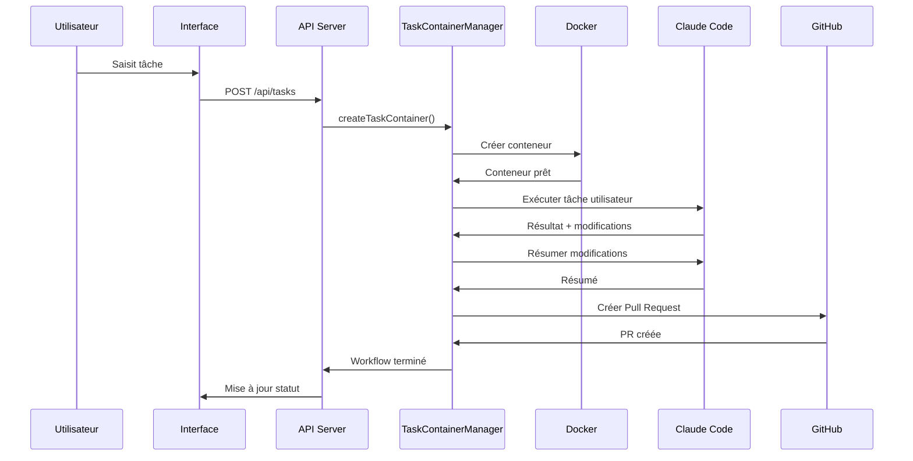

# CCWeb - Claude Code Web Platform

## 🚀 Vue d'ensemble

CCWeb est une plateforme web d'automatisation de développement qui permet aux développeurs d'exécuter des tâches de programmation assistées par IA dans des environnements Docker isolés, avec création automatique de Pull Requests GitHub.

### Fonctionnalités principales
- 🤖 **Exécution de tâches Claude Code** dans des conteneurs Docker isolés
- 🔐 **Authentification GitHub App** avec accès aux repositories privés
- 🐳 **Environnements Docker dynamiques** avec support multi-runtimes
- 🔄 **Workflow automatique** : Tâche → Exécution → Pull Request
- ⚙️ **Environnements personnalisables** avec variables d'environnement
- 📊 **Interface utilisateur moderne** avec Nuxt UI Pro

## 🏗️ Architecture Technique

### Stack Technologique
- **Frontend**: Nuxt 3, Vue 3, Nuxt UI Pro, TypeScript
- **Backend**: Nuxt Server API, MongoDB, Docker
- **IA**: Anthropic Claude Code
- **Intégration**: GitHub Apps, GitHub API
- **Infrastructure**: Docker containers, Node.js runtime

### Structure des Dossiers
```
ccweb/
├── app/                          # Frontend Nuxt.js
│   ├── components/              # Composants Vue réutilisables
│   │   ├── ChatPrompt.vue       # Interface de saisie des tâches
│   │   └── ...
│   ├── middleware/              # Middlewares de route
│   ├── pages/                   # Pages de l'application
│   │   ├── app/                # Pages principales de l'app
│   │   │   ├── index.vue       # Dashboard principal
│   │   │   └── settings/       # Configuration utilisateur
│   │   └── login.vue           # Page de connexion
│   └── layouts/                # Layouts de page
├── server/                      # Backend API
│   ├── api/                    # Endpoints API REST
│   │   ├── auth/               # Authentification GitHub
│   │   ├── tasks/              # Gestion des tâches
│   │   ├── environments/       # Environnements de dev
│   │   └── user/               # Gestion utilisateur
│   ├── models/                 # Modèles MongoDB
│   │   ├── Task.ts            # Modèle des tâches
│   │   ├── Environment.ts     # Environnements de développement
│   │   └── User.ts            # Utilisateurs
│   ├── utils/                  # Utilitaires backend
│   │   ├── task-container.ts   # Orchestrateur principal
│   │   ├── container-setup.ts  # Configuration conteneurs
│   │   ├── claude-executor.ts  # Exécution Claude Code
│   │   ├── pull-request-creator.ts # Création PRs GitHub
│   │   ├── repository-cloner.ts # Clonage repositories
│   │   ├── docker.ts           # Gestionnaire Docker
│   │   └── github-app.ts       # Intégration GitHub App
│   └── plugins/                # Plugins Nuxt server
└── public/                     # Assets statiques
```

## 📊 Modèles de Données

### TaskModel
```typescript
{
  userId: string,              // ID GitHub de l'utilisateur
  environmentId: ObjectId,     // Référence à l'environnement
  name: string,               // Nom de la tâche
  dockerId?: string,          // ID du conteneur Docker
  messages: [{                // Historique des messages
    role: 'user' | 'assistant',
    content: string,
    timestamp: Date
  }],
  pr?: {                      // Informations de la PR créée
    url: string,
    number: number
  },
  merged: boolean,            // Statut de fusion
  executed: boolean           // Statut d'exécution
}
```

### EnvironmentModel
```typescript
{
  userId: string,                    // Propriétaire de l'environnement
  name: string,                     // Nom de l'environnement
  repository: string,               // Nom du repository
  repositoryFullName: string,       // owner/repo format
  runtime: 'node' | 'python' | 'php', // Runtime principal
  environmentVariables: [{          // Variables d'environnement
    key: string,
    value: string
  }],
  configurationScript?: string      // Script de configuration
}
```

### UserModel
```typescript
{
  githubId: string,                    // ID unique GitHub
  username: string,                   // Nom d'utilisateur GitHub
  name?: string,                      // Nom complet
  email?: string,                     // Email
  anthropicKey?: string,              // Clé API Anthropic (chiffrée)
  githubAppInstallationIds: string[]  // IDs des installations GitHub App
}
```

## 🔄 Workflow Principal

### 1. Authentification et Configuration
```
Utilisateur → GitHub OAuth → Session → Configuration clé Anthropic
```

### 2. Création d'Environnement
```
Interface → Sélection Repository → Configuration Variables → Sauvegarde
```

### 3. Exécution de Tâche


## 🐳 Architecture des Conteneurs

### Configuration Docker
- **Image de base**: `ccweb-task-runner:latest` (construite dynamiquement)
- **Runtime support**: Node.js 20, Python 3.12, PHP 8.3, Rust, Go, Swift
- **Volumes**: Repository source + configuration Claude
- **Network**: Bridge mode pour isolation
- **User**: Root avec environnement configuré

### Cycle de vie d'un conteneur
1. **Création**: Image Docker avec runtime approprié
2. **Setup**: Installation Claude Code + configuration
3. **Clonage**: Repository GitHub avec authentification
4. **Exécution**: Commandes Claude automatiques
5. **Persistence**: Conteneur reste actif pour inspection
6. **Cleanup**: Nettoyage manuel des ressources

## 🔐 Sécurité

### Authentification
- **GitHub OAuth 2.0** pour l'authentification utilisateur
- **GitHub Apps** pour l'accès aux repositories privés
- **Sessions sécurisées** avec cookies HttpOnly

### Chiffrement
- **Clés API Anthropic** chiffrées en base de données
- **Tokens GitHub** régénérés à la demande
- **Variables d'environnement** isolées par conteneur

### Isolation
- **Conteneurs Docker** isolés par tâche
- **Réseaux bridge** séparés
- **Workspaces temporaires** avec cleanup automatique

## 🛠️ APIs Principales

### Authentification
- `GET /api/auth/github` - Initier OAuth GitHub
- `GET /api/auth/github-app` - Installation GitHub App
- `POST /api/user/anthropic-key` - Configuration clé Anthropic

### Environnements
- `GET /api/environments` - Liste des environnements
- `POST /api/environments` - Créer environnement
- `PUT /api/environments/:id` - Mettre à jour environnement
- `DELETE /api/environments/:id` - Supprimer environnement

### Tâches
- `POST /api/tasks` - Créer nouvelle tâche
- `POST /api/tasks/:id/container` - Créer conteneur pour tâche
- `POST /api/tasks/:id/execute` - Exécuter commande dans conteneur

### Monitoring
- `GET /api/monitoring/containers` - Statut des conteneurs
- `POST /api/monitoring/cleanup` - Nettoyer conteneurs inactifs

## 📝 Configuration

### Variables d'Environnement
```bash
# Base de données
DATABASE_URL=mongodb://localhost:27017/ccweb

# GitHub App
GITHUB_APP_ID=your_app_id
GITHUB_PRIVATE_KEY=path/to/private-key.pem
GITHUB_CLIENT_ID=your_oauth_client_id
GITHUB_CLIENT_SECRET=your_oauth_client_secret

# Chiffrement
ENCRYPTION_KEY=your_32_character_secret_key

# Session
SESSION_SECRET=your_session_secret
```

### Configuration Docker
```dockerfile
# server/utils/docker/Dockerfile
FROM python:3.12
RUN apt-get update && apt-get install -y nodejs npm
RUN npm install -g @anthropic-ai/claude-code
# ... configuration runtime
```

## 🚀 Installation et Déploiement

### Prérequis
- Node.js 20+
- Docker Engine
- MongoDB
- GitHub App configurée

### Installation locale
```bash
# Cloner le projet
git clone https://github.com/user/ccweb.git
cd ccweb

# Installer dépendances
pnpm install

# Configurer variables d'environnement
cp .env.example .env
# Éditer .env avec vos configurations

# Démarrer MongoDB
docker run -d -p 27017:27017 --name mongodb mongo:latest

# Construire image Docker personnalisée
docker build -t ccweb-task-runner:latest server/utils/docker/

# Démarrer en développement
pnpm dev
```

### Configuration GitHub App
1. Créer une GitHub App sur GitHub
2. Configurer les permissions : Repository (Read/Write), Pull Requests (Write)
3. Générer une clé privée
4. Noter l'App ID et installer l'app sur les repositories

## 🧪 Utilisation

### Créer un Environnement
1. Se connecter via GitHub
2. Aller dans "Paramètres" → "Environnements"
3. Sélectionner un repository GitHub
4. Configurer les variables d'environnement
5. Sauvegarder

### Exécuter une Tâche
1. Sélectionner un environnement
2. Saisir la description de la tâche
3. Cliquer "Envoyer"
4. Observer l'exécution en temps réel
5. Vérifier la Pull Request créée automatiquement

## 🔍 Monitoring et Observabilité

### Logs Applicatifs
- Création et gestion des conteneurs
- Exécution des commandes Claude
- Opérations Git et GitHub API
- Erreurs et exceptions détaillées

### Métriques Docker
- Statut des conteneurs actifs
- Utilisation des ressources
- Temps d'exécution des tâches

### Alertes
- Échecs de création de conteneurs
- Erreurs d'authentification GitHub
- Timeouts d'exécution Claude

## 🐛 Debugging et Troubleshooting

### Logs de Debug
```bash
# Logs conteneurs Docker
docker logs <container_id>

# Logs application Nuxt
tail -f .nuxt/dev/server.log

# Monitoring conteneurs actifs
GET /api/monitoring/containers
```

### Problèmes Courants
- **"GitHub App not installed"**: Installer l'app sur le repository
- **"Docker image not found"**: Construire l'image `ccweb-task-runner:latest`
- **"Claude command failed"**: Vérifier la clé API Anthropic
- **"Permission denied"**: Vérifier les permissions GitHub App

## 🚧 Développement et Contribution

### Architecture du Code
- **Modularité**: Classes spécialisées par responsabilité
- **DRY**: Pas de duplication de code
- **Testabilité**: Injection de dépendances
- **Maintenabilité**: Documentation inline et typage TypeScript

### Standards de Code
- TypeScript strict mode
- ESLint + Prettier
- Convention de nommage camelCase
- Comments JSDoc pour les APIs publiques

### Tests
```bash
# Tests unitaires
pnpm test

# Tests d'intégration
pnpm test:e2e

# Coverage
pnpm test:coverage
```

## 📚 Resources et Liens

- **Documentation Nuxt 3**: https://nuxt.com/docs
- **Anthropic Claude**: https://docs.anthropic.com/
- **GitHub Apps**: https://docs.github.com/en/apps
- **Docker**: https://docs.docker.com/
- **MongoDB**: https://docs.mongodb.com/

## 🤝 Support et Communauté

Pour questions, bugs ou contributions :
- Ouvrir une issue sur GitHub
- Consulter la documentation technique
- Rejoindre les discussions de la communauté

---

*Cette documentation est maintenue à jour avec chaque release majeure du projet.*