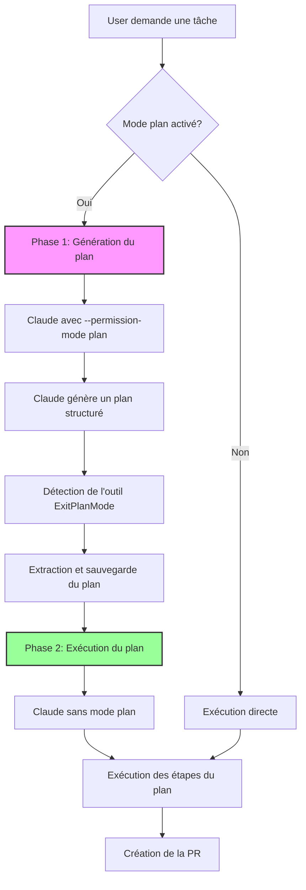

# Mode Plan dans Open-rcode

## Vue d'ensemble

Le mode plan est une fonctionnalité avancée d'open-rcode qui permet à Claude de planifier et structurer son approche avant d'exécuter des tâches complexes. Cette approche en deux phases améliore la qualité et la cohérence des résultats pour les tâches nécessitant une réflexion approfondie.

## Architecture et workflow

### Workflow en deux phases



### Phase 1: Génération du plan

Dans cette phase, Claude analyse la demande et crée un plan détaillé :

1. **Activation du mode plan** : La commande Claude est exécutée avec `--permission-mode plan`
2. **Analyse de la demande** : Claude comprend les objectifs et contraintes
3. **Génération du plan** : Claude structure son approche en étapes claires
4. **Outil ExitPlanMode** : Claude utilise cet outil spécial pour marquer la fin de la planification

### Phase 2: Exécution du plan

Une fois le plan capturé :

1. **Préparation du prompt** : Le plan est préfixé au prompt original
2. **Exécution normale** : Claude exécute sans `--permission-mode plan`
3. **Suivi des étapes** : Chaque action est enregistrée en temps réel
4. **Finalisation** : Création de la pull request avec les changements

## Commandes exactes utilisées

### Commande en mode plan (Phase 1)
```bash
claude --verbose --output-format stream-json --permission-mode plan --model sonnet -p "prompt"
```

### Commande d'exécution (Phase 2)
```bash
claude --verbose --output-format stream-json --model sonnet -p "Voici le plan à exécuter :

[PLAN EXTRAIT]

[PROMPT ORIGINAL]"
```

## Détection et extraction du plan

### Format JSON de l'outil ExitPlanMode

```json
{
  "type": "assistant",
  "message": {
    "content": [
      {
        "type": "tool_use",
        "id": "tool_use_abc123",
        "name": "ExitPlanMode",
        "input": {
          "plan": "Le plan structuré en markdown..."
        }
      }
    ]
  }
}
```

### Processus d'extraction dans `executePlanCommand`

```typescript
// Détection du mode plan activé
if (jsonData.type === 'system' && jsonData.permissionMode === 'plan') {
  isInPlanMode = true
}

// Capture du plan depuis ExitPlanMode
if (content.type === 'tool_use' && 
    content.name === 'ExitPlanMode' && 
    content.input?.plan) {
  planContent = content.input.plan
}
```

## Intégration UI/Backend

### 1. Configuration de l'environnement

Les environnements peuvent activer le mode plan via le champ `planMode` :

```typescript
// Environment model
{
  repositoryFullName: string,
  aiProvider: 'anthropic-api' | 'claude-oauth',
  model: 'opus' | 'sonnet',
  planMode?: boolean  // Active le mode plan
}
```

### 2. Création de tâche avec mode plan

```typescript
// POST /api/tasks
{
  environmentId: "env_123",
  text: "Refactor authentication system",
  planMode: true  // Hérite de l'environnement ou override
}
```

### 3. Affichage dans l'interface

- Un badge "Mode plan" apparaît sur les tâches concernées
- Le plan est affiché comme un message séparé avant l'exécution
- Les coûts sont trackés séparément pour chaque phase

## Outils disponibles pendant le mode plan

### Outils de planification

Pendant la phase de planification, Claude a accès à des outils spéciaux :

1. **ExitPlanMode** : Marque la fin de la planification
   - Paramètre requis : `plan` (string) - Le plan structuré en markdown
   - Cet outil déclenche la transition vers la phase d'exécution

### Outils d'exécution

Pendant l'exécution du plan, Claude a accès à tous les outils standards :

1. **Bash** : Exécution de commandes shell
2. **Read** : Lecture de fichiers
3. **Write** : Écriture de fichiers
4. **Edit** : Modification de fichiers
5. **MultiEdit** : Modifications multiples
6. **Grep** : Recherche dans les fichiers
7. **Glob** : Recherche par motifs
8. **LS** : Liste des fichiers
9. **WebFetch** : Récupération de contenu web
10. **WebSearch** : Recherche sur le web
11. **TodoWrite** : Gestion des tâches
12. **Task** : Lancement d'agents spécialisés

## Gestion des erreurs et fallbacks

### Échec du mode plan

Si la génération du plan échoue :

```typescript
if (planResult.exitCode !== 0) {
  // Fallback automatique vers le mode normal
  return this.executeAndSaveToolMessages(
    containerId, prompt, workdir, 
    aiProvider, model, task, 
    'Exécution de commande'
  )
}
```

### Plan non trouvé

Si aucun plan n'est détecté après l'exécution :

```typescript
if (!planContent) {
  // Exécution directe du prompt original
  return this.executeAndSaveToolMessages(...)
}
```

## Suivi des coûts

Le mode plan génère deux entrées de coût :

1. **Coût de planification** : Capturé depuis `total_cost_usd` de la phase 1
2. **Coût d'exécution** : Capturé depuis la phase 2

```typescript
// Sauvegarde du coût du mode plan
if (totalCostUsd) {
  await UserCostModel.create({
    environmentId: task.environmentId,
    userId: task.userId,
    taskId: task._id,
    costUsd: totalCostUsd,
    model: model,
    aiProvider: aiProvider
  })
}
```

## Exemples concrets d'utilisation

### Exemple 1: Refactoring complexe

**Prompt utilisateur** :
```
Refactoriser le système d'authentification pour utiliser JWT au lieu des sessions
```

**Plan généré** :
```markdown
Je vais refactoriser le système d'authentification pour utiliser JWT :

1. **Analyse du système actuel**
   - Examiner les modèles Session et User
   - Identifier les endpoints d'authentification
   - Comprendre le flux actuel

2. **Implémentation JWT**
   - Installer les dépendances nécessaires
   - Créer des utilitaires JWT
   - Modifier les endpoints d'auth

3. **Migration des données**
   - Adapter les middlewares
   - Mettre à jour les routes protégées

4. **Tests et validation**
   - Vérifier la compatibilité
   - Tester les nouveaux tokens
```

### Exemple 2: Nouvelle fonctionnalité

**Prompt utilisateur** :
```
Ajouter un système de notifications en temps réel avec WebSockets
```

**Plan généré** :
```markdown
Plan pour implémenter les notifications en temps réel :

1. **Architecture WebSocket**
   - Installer socket.io pour Nuxt
   - Configurer le serveur WebSocket
   - Créer les événements de base

2. **Modèle de données**
   - Créer le modèle Notification
   - Ajouter les relations utilisateur

3. **Backend**
   - Endpoints pour marquer comme lu
   - Système d'émission d'événements
   - Gestion des connexions

4. **Frontend**
   - Composant de notifications
   - Store Pinia pour l'état
   - Intégration dans la navbar
```

## Limitations et considérations

### Limitations techniques

1. **Providers supportés** : Uniquement `anthropic-api` et `claude-oauth`
2. **Modèles supportés** : Opus et Sonnet
3. **Pas de support Gemini** : Le mode plan n'est pas disponible avec Gemini

### Considérations de performance

1. **Double exécution** : Augmente le temps total d'exécution
2. **Coûts doublés** : Deux appels API sont nécessaires
3. **Timeout** : Le timeout de 30 minutes s'applique à chaque phase

### Bonnes pratiques

1. **Tâches complexes** : Utiliser pour les tâches nécessitant plusieurs étapes
2. **Refactoring** : Idéal pour les changements structurels importants
3. **Nouvelles features** : Parfait pour planifier l'architecture avant l'implémentation

## Configuration avancée

### Variables d'environnement

Aucune variable spécifique au mode plan, mais les clés API standard sont requises :

- `ANTHROPIC_API_KEY` : Pour le provider anthropic-api
- `CLAUDE_CODE_OAUTH_TOKEN` : Pour le provider claude-oauth

### Logs et debugging

Les logs du mode plan utilisent des emojis spécifiques :

- 🎯 : Début du mode plan
- 📋 : Sortie du plan
- ✅ : Mode plan activé
- 📄 : Plan capturé
- 💰 : Coût calculé
- 🏃 : Exécution du plan

## Évolutions futures possibles

1. **Support Gemini** : Adapter pour les modèles Gemini
2. **Plans itératifs** : Permettre la révision du plan
3. **Templates de plans** : Plans prédéfinis pour tâches communes
4. **Analyse de plans** : Métriques sur la qualité des plans
5. **Plans collaboratifs** : Révision humaine avant exécution