# CCWeb Workflow Architecture

```mermaid
graph TD
    A[User submits task via ChatPrompt.vue] --> B[POST /api/tasks - Create Task]
    B --> C[TaskModel saved with user message]
    C --> D[POST /api/tasks/id/container - Create Container]
    
    D --> E[TaskContainerManager createTaskContainer]
    E --> F[ContainerSetup setupContainer]
    
    F --> G[Get Task, Environment, User from DB]
    G --> H[Decrypt Anthropic API Key]
    H --> I[Generate Container Name & Workspace]
    I --> J[Prepare Environment Variables]
    J --> K[RepositoryCloner cloneToHost]
    
    K --> L{GitHub Token Available?}
    L -->|Yes| M[Clone with GitHub App Token]
    L -->|No| N[Clone Public Repository]
    M --> O[Configure Git in Cloned Repo]
    N --> O
    O --> P[Setup Docker Volumes]
    
    P --> Q[Ensure Docker Image Available]
    Q --> R{Image Exists?}
    R -->|No| S[Build ccweb-task-runner:latest]
    R -->|Yes| T[Create Docker Container]
    S --> T
    
    T --> U[Wait for Container Ready]
    U --> V[Update Task with Container ID]
    V --> W[ClaudeExecutor executeWorkflow]
    
    W --> X[Execute First Claude Command]
    X --> Y[Claude processes user request]
    Y --> Z[Save Claude output to task messages]
    Z --> AA[Wait 2 seconds]
    AA --> BB[Check Git Status]
    BB --> CC[Execute Summary Claude Command]
    CC --> DD[Claude summarizes changes]
    DD --> EE[Save summary to task messages]
    
    EE --> FF[PullRequestCreator createFromChanges]
    FF --> GG{Changes Detected?}
    GG -->|No| HH[Save No changes message]
    GG -->|Yes| II[Create Git Branch]
    
    II --> JJ[Git add and Git commit]
    JJ --> KK{GitHub Token Available?}
    KK -->|No| LL[Save No token message]
    KK -->|Yes| MM[Git push to GitHub]
    
    MM --> NN[Create GitHub Pull Request via API]
    NN --> OO[Save PR created message]
    OO --> PP[Workflow Complete]
    LL --> PP
    HH --> PP
    
    PP --> QQ[Container keeps running for manual access]
    
    %% Cleanup flow
    QQ -.-> RR[Manual: ContainerCleanup cleanupTaskContainer]
    RR -.-> SS[Stop & Remove Docker Container]
    SS -.-> TT[Delete Workspace Files]
    
    %% Styling
    classDef userAction fill:#e1f5fe
    classDef apiEndpoint fill:#f3e5f5
    classDef containerOp fill:#e8f5e8
    classDef claudeOp fill:#fff3e0
    classDef gitOp fill:#fce4ec
    classDef decision fill:#f1f8e9
    
    class A userAction
    class B,D apiEndpoint
    class E,F,T,U containerOp
    class W,X,Y,CC,DD claudeOp
    class K,M,N,O,II,JJ,MM,NN gitOp
    class L,R,GG,KK decision
```

## Key Components

### 1. **User Interface Layer**
- `ChatPrompt.vue` - User input interface
- Captures user tasks and sends to backend

### 2. **API Layer**
- `POST /api/tasks` - Creates new task
- `POST /api/tasks/:id/container` - Triggers container creation

### 3. **Container Management Layer**
- `TaskContainerManager` - Main orchestrator
- `ContainerSetup` - Docker environment setup
- `ContainerCleanup` - Resource cleanup

### 4. **Repository Management**
- `RepositoryCloner` - GitHub repository cloning
- Handles GitHub App authentication
- Fallback for public repositories

### 5. **Claude Integration Layer**
- `ClaudeExecutor` - Claude Code command execution
- Manages two-phase workflow (execution + summary)

### 6. **Git & PR Management**
- `PullRequestCreator` - Git operations and GitHub PR creation
- Automatic branch creation and commit generation

### 7. **Data Layer**
- MongoDB with TaskModel, EnvironmentModel, UserModel
- Message threading for conversation history